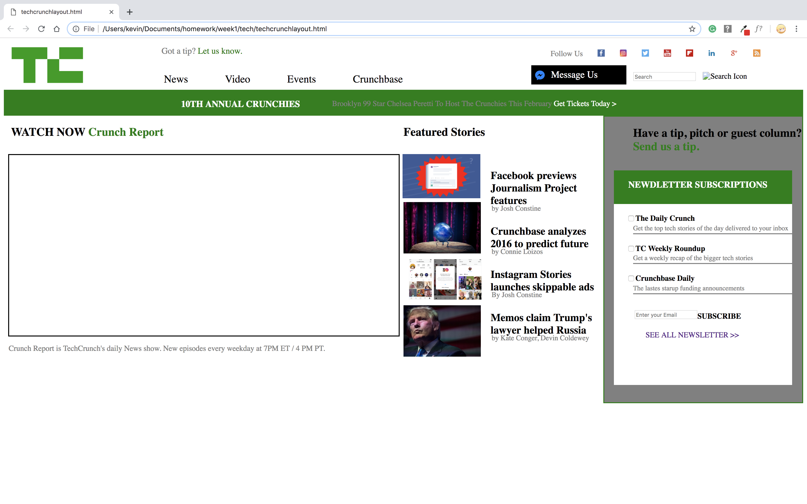

# Mock Tech Crunch Web Page
A mock tech crunch web page to get some html and css practice.

## How It's Made:

**Tech used:** HTML, CSS

I started with writing the html to get the content of the webpage. After that was done, I linked the css file to the html. One's that was done, I started to create the layout of the web page and get it to look the same as much as possible.

## Lessons Learned:

I learned about media query and about layouts.
